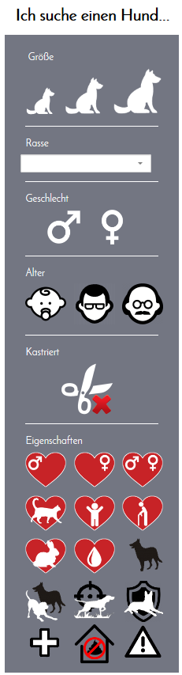

# Zum Benutzen:

npm install --save express ejs lodash moment mongodb object-hash x-ray

zum Ausführen: node index.js

Ich habe nochmal andere Icons benutzt, sorry :), aber ich wollte mit diesem Effekt spielen, wenn man ein Icon anklickt und das war bei unseren bisherigen Icons etwas schwieriger.

# Suche 

