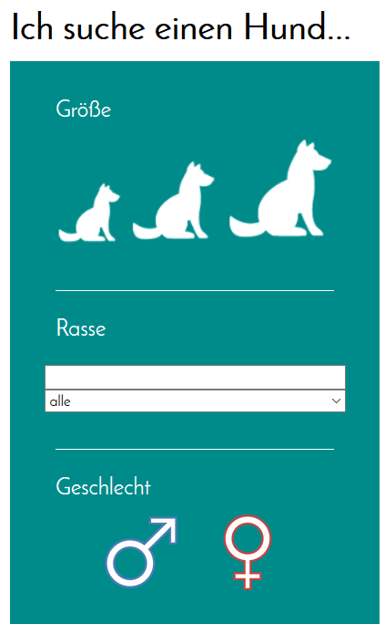
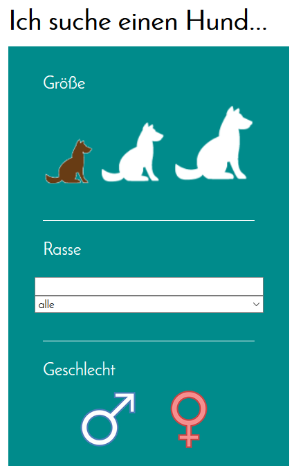

# Zum Benutzen:

npm install --save express

npm install --save ejs

zum Ausführen: node index.js

# Wenn Icons nicht angeklickt wurden:

 

# Wenn Icons angeklickt wurden - man sieht die Auswahl:

